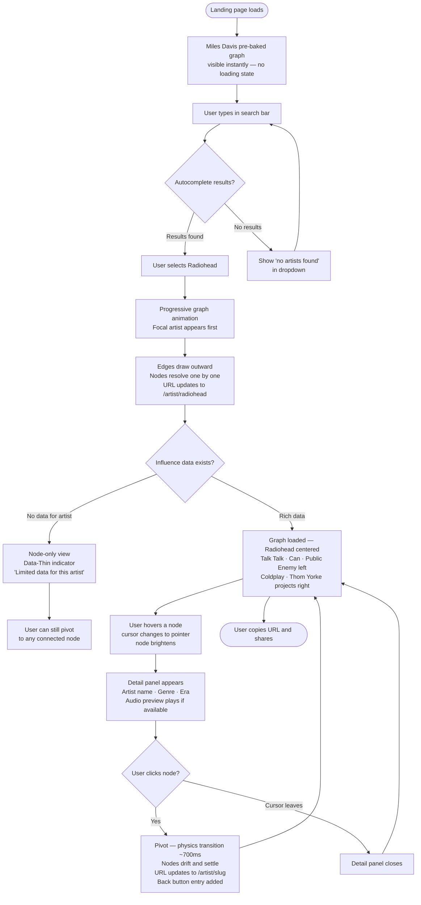
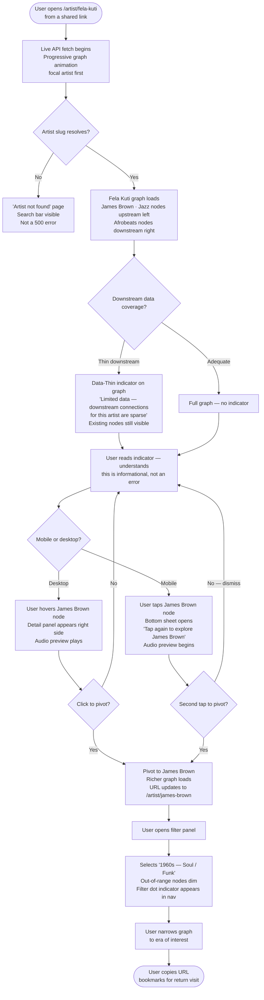
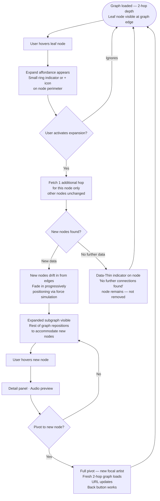

# UX Design Specification Dig

**Author:** Jon
**Date:** 2026-05-24

---

## Executive Summary

### Project Vision

Dig is an open-source musical influence graph explorer — a tool for following the threads of musical lineage, not finding similar sounds. Search any artist and a living graph appears: upstream influences radiating left, downstream influenced artists spreading right. Click any node and the graph recenters; the thread continues.

The design philosophy is established from the first pixel: **the graph is the world, not a widget on a page.** A full-bleed dark canvas. UI chrome floating over it. No onboarding modal, no tutorial — the graph teaches itself.

The landing experience opens on Miles Davis — a deliberate choice. His connections span jazz, funk, hip-hop, and rock across six decades. It's an implicit argument for the product before a word is read: *this goes deeper than you expected.* The search bar sits prominently over the graph. Below it: **"Follow the thread."** No more instruction needed.

### Target Users

**The Music Obsessive (Primary)**
Opens seven Wikipedia tabs at 2am tracing an influence chain they started for fun and couldn't stop. Tech-comfortable, discovery-driven. Already does this work manually — Dig visualizes it. Their core behavior is following threads *and* starting new ones, which is why search stays visible and accessible at all times. Hiding it behind a tap breaks their flow.

**The Curious Listener (Secondary)**
Arrives most often via a shared link. Doesn't know what MusicBrainz is, but knows the feeling of "why does this sound like that?" Must be able to navigate the product without a tutorial. The graph teaches itself — but only if the opening state is legible and inviting.

### Key Design Challenges

**1. Graph density at 2-hop depth**
A well-documented artist at 2-hop default depth may surface 40–80 nodes. The graph must feel like a night sky — rich, dense, navigable — not chaotic or overwhelming. Node collision management, edge rendering, and label legibility at default zoom are live constraints.

**2. Full-bleed canvas with floating chrome**
No padding, no card border, no white space frame. UI elements — search bar, filter controls, detail panels — float *over* the canvas, not beside it. This creates real challenges: chrome must not obscure the graph center, floating elements on mobile can cover too much of the canvas, and layering hierarchy must be carefully managed across states.

**3. Mobile navigability at 375px**
A 2-hop force-directed graph at 375px is genuinely hard. The two-tap model (detail panel first → second tap pivots) addresses imprecise finger-targeting and creates a confirmation moment before committing to navigation. But node sizing, label legibility, and panning behavior on mobile require dedicated design attention beyond just making it "work."

**4. Physics-based pivot transition**
The pivot animation is non-negotiable — nodes drift and settle like stars rearranging. But a smooth physics-based transition with 50+ nodes requires precision tuning: duration, damping, how nodes that leave the graph exit gracefully, how the new focal artist announces itself. Too slow feels heavy; too fast loses the magic.

**5. Data-Thin states as first-class UX**
Sparse data is an expected condition, not an error — especially for the downstream (right) side of contemporary artists. The UX must communicate "this is what we have" in the voice of a knowledgeable friend, not a system failure. This is a copy, visual, and layout problem simultaneously.

### Design Opportunities

**1. Miles Davis as the opening argument**
The landing graph isn't decoration — it's the product's first pitch. A beautifully composed opening graph of Miles Davis on a full-bleed dark canvas, showing connections across six decades and four genres, does more work than any marketing copy. The graph needs to earn that moment.

**2. "Follow the thread" as a design language**
The tagline maps directly to the core interaction. It should inform micro-copy throughout: empty states, Data-Thin messages, node hover labels. The voice is a knowledgeable music friend — direct, curious, never corporate.

**3. Epoch labels on decade filters**
"1960s — British Invasion / Motown" as a single selectable filter item is a signature UX detail: data-driven structure with cultural resonance. Decades are universally understood and data-mappable; epoch names are evocative. Combining them is clever without being clever about it.

**4. Audio as a sensory layer**
On mobile, audio preview lives in the detail panel — the first tap. If a preview begins the moment the panel opens, the experience becomes tactile and sensory, not purely visual. For the curious listener arriving via a shared link, this is the moment that makes the product feel alive.

**5. Full-bleed immersion as brand**
No other music tool treats the graph canvas as a full-bleed world you're *inside*. This choice is the product's visual identity before a color or typeface is chosen. Executed well, Dig feels like a place.

---

## Core User Experience

### Defining Experience

The core loop of Dig is: **search → progressive graph reveal → explore → pivot → unexpected connection → share.** Every design decision is in service of making that loop as fast, frictionless, and repeatable as possible.

The pivot — clicking a node and recentering the graph on a new focal artist — is the primary interaction primitive. It is how users follow threads. It must feel instantaneous and inevitable, never like navigating to a new page.

The product's emotional payoff is the unexpected connection: the moment a user sees something they didn't know and couldn't have found anywhere else this quickly. *"James Brown influenced Radiohead?! Aphex Twin influenced Kendrick?!"* That is the moment Dig earns its place in their life. Design decisions compound toward this moment.

### Platform Strategy

**Primary platform:** Web (Next.js), desktop-first. Mouse and keyboard are the primary input model. The graph canvas benefits from cursor precision, scroll-to-zoom, and hover states.

**Mobile:** Fully responsive at 375px minimum. Touch-adapted interaction model: two-tap (detail panel → pivot), pinch-to-zoom, drag-to-pan. Mobile is a first-class platform, not a graceful degradation.

**Data strategy split:**
- **Landing graph (Miles Davis):** Pre-baked static JSON. Renders instantly — no API call, no loading state, no risk. The landing experience must be immediate. This graph is curated, not live.
- **All subsequent graphs:** Live API fetch (MusicBrainz, Wikipedia, Wikidata). Progressive node animation serves as the loading state — the graph coming alive is the waiting experience.

**No offline mode.** Data is live by nature; offline support is out of scope for v1.

### Effortless Interactions

**Pivot — one click, world recenters.**
No navigation, no page load, no confirmation. Click a node, the graph transitions. The physics simulation handles the rest.

**Search — type, select, done.**
Live autocomplete. Select a result and the graph loads. Zero intermediate steps between intent and outcome.

**URL sharing — zero friction.**
Every graph state is already a link. The URL bar is the share button. No modal, no copy-link button required (though one may exist as a convenience). The user can share by pasting the URL; that's the whole feature.

**Progressive load as experience.**
When a graph loads, the focal artist appears first. Edges draw outward. Nodes resolve one by one. The user is watching the graph come alive — not waiting for a spinner to finish. The loading state IS the animation; they are the same thing.

**Physics layout — self-organizing.**
The force simulation positions nodes. Users never arrange anything. The graph finds its own shape; the user explores it.

### Critical Success Moments

**1. The landing (0–3 seconds)**
Miles Davis appears instantly — pre-baked, no delay. A full-bleed dark canvas. Connections spanning jazz, funk, hip-hop, rock. The graph is beautiful before the user has done anything. The tagline "Follow the thread." sits beneath the search bar. The product explains itself.

**2. The curated aha (within 10 seconds)**
The Miles Davis opening graph must be deliberately composed to contain at least one surprising, visible connection — accessible without pivoting or scrolling. A connection that makes a user stop and say "I didn't know that." This is a curation constraint on the landing graph, not a happy accident. *The aha moment must be possible in under 10 seconds from page load.*

**3. The first pivot**
The user clicks a node. The graph recenters. Nodes drift and settle like stars rearranging. In this moment, the user understands what Dig is — not intellectually, but physically. They feel the thread. This transition must be tuned to land in the uncanny valley between animation and physics: natural, not mechanical.

**4. The share**
A user copies the URL and sends it to someone. The recipient opens it and sees the same graph, instantly. No login, no setup, no "you need to install." This moment validates the product's stateless architecture as a feature, not a compromise.

### Experience Principles

**1. The graph is the interface.**
UI chrome serves the graph. Every pixel of search bar, filter control, and detail panel exists only to enable what happens on the canvas. If it doesn't serve the graph, it doesn't ship.

**2. Exploration over destination.**
Users don't come to Dig for a specific answer. They come to wander. The product rewards aimless following — it should always be easier to keep going than to stop.

**3. Physics as emotional register.**
The force simulation is not a technical implementation choice — it is the product's emotional character. Nodes drift, settle, breathe. Animation is meaning. The moment the pivot animation becomes a page transition, the product dies.

**4. The loading IS the experience.**
Progressive reveal is not a loading state with a pretty face — it is the product's first act in every graph. The focal artist appears, then the connections resolve. The user watches the picture form. This is intentional, not waiting.

**5. Honest about what we know.**
Data gaps, thin connections, and sparse downstream graphs are communicated directly and calmly — in the voice of a knowledgeable friend, never as system errors. "We don't have much on this one" is information, not failure.

**6. The aha within 10 seconds.**
The product must create the possibility of an unexpected discovery within 10 seconds of landing. This is a design constraint on the opening graph curation, on node label legibility at default zoom, and on how connection direction is communicated spatially.

---

## Desired Emotional Response

### Primary Emotional Goals

**North star: Recognition.**

Not surprise. Not delight. *Recognition* — the moment a user hears music differently because of what Dig showed them.

*"Of course that's where it came from. Now I hear it everywhere."*

This is the deepest thing Dig can do. It is not just a discovery tool — it is a perception-changing tool. Used enough, Dig rewires how you listen. And critically: this emotion doesn't require building anything beyond what is already being built. It requires building what we're building and building it well. The recognition emerges from the graph working correctly. The design job is to not get in the way of it.

**The design filter:** *Does this help the user hear music differently?* If yes, ship it. If no, question it.

### Emotional Journey Mapping

| Stage | Target Emotion | What Triggers It |
|-------|---------------|-----------------|
| Landing (0–3s) | **Wonder** | Miles Davis graph, full-bleed canvas, connections spanning six decades visible before any interaction |
| First search | **Anticipation** | Progressive node animation — watching the graph come alive |
| First pivot | **Flow** | Zero-friction transition; the thread pulls them forward; 25 minutes pass without noticing |
| Unexpected connection | **Delight → Recognition** | "James Brown influenced Radiohead?!" collapses into "of course — now I hear it" |
| Data-Thin state | **Trust** | Honest, calm language: "we don't have much on this one" from a knowledgeable friend |
| Sharing a URL | **Pride** | "Look at this thing I found / this path I traced" |
| Return visit | **Habitual curiosity** | Real life fires the trigger (bought a record, heard something new); Dig is simply where they go |

### Emotional Journey: The Return Visit

The primary return driver is **habitual curiosity tied to real-world music moments** — someone buys a record, hears something on the radio, gets a recommendation from a friend. Dig is the place they go to understand it. Real life manufactures the trigger; Dig doesn't need to.

Sharing is the **viral driver** — how new users arrive. It is not a retention mechanic; it is the natural impulse of a user who just had the recognition moment and needs to show someone.

Completion drive is real but secondary — and deliberately unsupported in v1 (no saved state). Users who want to return to a specific thread use the shareable URL. That is the extent of state persistence, and it is enough.

**Design implication:** Dig needs no retention mechanics. No streaks, no notifications, no "you haven't visited in a while." It needs to be so reliably good at its one job that users think of it automatically when the real-world trigger fires: *"I just heard this — let me dig it."* That is the habit. Earn it through quality.

### Micro-Emotions

**Emotions to cultivate:**
- **Anticipation** — the progressive graph reveal creates it before a single node is readable
- **Trust** — Data-Thin honesty, no pretense about coverage, error states that are calm and informative
- **Flow** — the pivot loop is so smooth the user loses track of time; this is the 25-minutes-later state
- **Pride** — the shareable URL is the natural output of a discovery worth showing someone

**Emotions to actively design against:**

| Emotion | Source | Design Response |
|---------|--------|----------------|
| **Overwhelm** | Node density at 2-hop depth | Force layout tuning, progressive depth reveal, on-demand expansion vs. auto-loading |
| **Confusion** | Directional ambiguity (which side is roots vs. legacy) | Spatial encoding (left/right) is primary signal; reinforced by labels, not color alone |
| **Frustration** | Loading delays, broken states | Progressive reveal as loading experience; honest degradation when APIs are slow |
| **Embarrassment** | Thin data states that feel like user error | Language and visual treatment: "we don't have much here" never implies the user did something wrong |

### Design Implications

**Recognition → Readability is critical.**
For a user to hear music differently, they must be able to *read* the connections — artist labels legible at default zoom, relationship direction immediately clear, ability to hold multiple nodes in view at once. Recognition cannot happen if the graph is visually dense to the point of illegibility.

**Trust → Honesty is a design material.**
Data-Thin states, sparse downstream graphs, and empty states are not failures to apologize for — they are information to deliver clearly. The product is as transparent about what it doesn't know as what it does. This honesty is itself a form of quality.

**Flow → Remove every obstacle from the pivot loop.**
Any friction in the core loop — modals, confirmation dialogs, loading interruptions, search requiring a tap to reveal — fails the emotional brief. The thread must always be one click/tap away from continuing.

**No retention mechanics → Earn the return visit.**
The product must be so reliable and so good at its single job that it becomes the automatic response to a music curiosity trigger. This is a quality bar, not a feature.

### Emotional Design Principles

**1. Recognition is the north star.**
Every design decision is measured against: *"Does this help the user hear music differently?"* Not engagement, not session length, not page views. Perception change.

**2. Emotions are earned, not manufactured.**
No dark patterns, no retention hooks, no manufactured urgency. The product earns return visits through excellence. Real life provides the triggers; Dig provides the answer.

**3. Trust through honesty.**
The product is transparent about data coverage — always. A sparse graph delivered honestly earns more trust than a dense graph that hides its gaps.

**4. Flow over features.**
Anything that interrupts the thread fails the emotional brief. Every modal, every loading state, every required tap is a cost measured against the flow state it interrupts.

**5. Delight lives in the data, not the decoration.**
The unexpected connection is delightful because of what the graph *knows*, not because of an animation flourish or UI trick. Design should surface the data clearly and get out of the way.

---

## UX Pattern Analysis & Inspiration

### Inspiring Products Analysis

**Letterboxd** — *The passion product benchmark*
Letterboxd works because it feels like it was built by someone who actually loves film. Not by a product team optimizing retention metrics — by a person who wanted this to exist and built it for people like themselves. That is Dig's energy. Passionate, opinionated, unashamed about being for people who care deeply. The design lesson: let the builder's love show through. Users who care can tell the difference between a product made for them and a product made for a target demographic.

**Are.na** — *Deliberate non-algorithm*
Are.na trusts its users to be curious and intelligent. No "you might also like," no algorithmic spoon-feeding. It assumes users know what they're looking for and gets out of the way. Dig shares this value: the product respects the user's intelligence. There are no recommendations. No similarity suggestions. No "because you searched Miles Davis." The graph shows what's true; the user decides where to go.

**Wikipedia** — *What to replace, not what to copy*
Wikipedia is where Dig's data lives right now — scattered, text-heavy, requiring seven open tabs to follow a single influence thread. It is the problem Dig solves made visible. Study it to understand the friction: the cognitive load of synthesizing influence information from prose, the tab management, the loss of spatial context across articles. Dig is what this information looks like when it becomes visual and navigable. Wikipedia is the before.

**Roam Research / TheBrain** — *Borrow mechanics, reject aesthetic*
Both demonstrate viable graph interaction patterns: bidirectional navigation, expand-on-demand node exploration, the sense that every node is a door. The interaction model is directly relevant to Dig. The aesthetic — productivity tool, utilitarian, built for knowledge workers — is completely wrong for a cultural product about music. Borrow the mechanics. Reject the visual language entirely.

**The Pudding (pudding.cool)** — *Data journalism as play*
The Pudding takes datasets and turns them into things you explore rather than read. "Who's the most referenced musician in rap lyrics?" — the answer is a visual you navigate, not a paragraph you skim. This is Dig's editorial energy: data that has a point of view and delivers it beautifully. The graph isn't a neutral display of relationships — it's an argument that musical history is interconnected in ways worth seeing.

**Astronomical charts and star maps** — *Visual language reference*
Not a UI reference — a visual language reference. The "night sky" aesthetic established for the graph canvas has a history. Dense with information. Beautiful. Navigable. Star maps communicate complexity without overwhelm because of deliberate decisions about density, brightness hierarchy, and the darkness of the canvas that makes each point of light matter. This is the visual grammar Dig is working in.

**Every Noise at Once (everynoise.com)** — *The closest existing analogue*
A spatial map of every music genre, positioned by acoustic and cultural similarity. Not a graph, but the closest existing tool to what Dig should feel like — a place where music data becomes spatial and explorable. Study it for: how it handles density without losing readability, how spatial position carries meaning, how it invites exploration without explaining itself. Note what's missing: it's static, not navigable through time, and has no concept of influence direction. Dig adds the dimension Every Noise doesn't have.

---

### Transferable UX Patterns

**Start sparse, expand on demand.**
The pattern that works across every graph visualization that works: never dump 80 nodes on screen at once. Start with the focal artist and 1–2 hops. Let the user pull the graph open. Don't push it at them. The expand-on-demand mechanism (FR-7) is validated by every reference that gets this right — The Pudding's network pieces, Roam's graph, History Trends. The principle: the user's curiosity drives density, not the system's eagerness to show everything.

**The builder's love as a design material.**
Letterboxd's great UX secret is legible passion. Users who care deeply about a subject can tell when a product was made by someone who also cares. This shows up in micro-copy, in the specificity of design decisions, in what the product refuses to do. Dig's voice, its Data-Thin honesty, its refusal to recommend by similarity — these are all expressions of a builder who cares about music history, not about engagement metrics.

**Trust the user's intelligence; give them no algorithm.**
Are.na's pattern: no recommendations, no suggestions, no "based on your activity." Present what's true. Let the user navigate. Dig applies this to the graph: the connections shown are sourced from open music data, not ranked by engagement or filtered by taste profile. Every node visible in the graph earned its place through documented influence, not algorithmic weight.

**Data with a point of view.**
The Pudding's pattern: every visualization is making an argument. The data isn't neutral; the presentation reveals something. Dig's point of view: musical history is a living graph of influence, not a flat list of "sounds like." The graph IS the argument. It should be composed — particularly the landing graph — to make that argument land in under 10 seconds.

**Spatial meaning over legend.**
Every Noise at Once positions genres spatially so that proximity carries meaning. Dig uses left/right spatial encoding for upstream/downstream influence. Both approaches let the space itself teach the user rather than requiring a legend or tutorial. If a design element needs an explanation, the spatial encoding has failed.

---

### Anti-Patterns to Avoid

**"Fans Also Like" — similarity masquerading as discovery.**
Spotify's "Fans Also Like" section is the perfect anti-reference. "You like Radiohead, here are 8 bands that sound like Radiohead." That is not discovery — it is a slightly wider version of what you already know. Dig will never do this. Dig doesn't show what sounds similar; it shows what came before, what came after, and why.

The deeper anti-pattern: **algorithmic homogenization.** When every tool recommends by similarity, everyone's taste converges. Dig goes the other direction — it shows the divergent paths, the unexpected connections, the places where genres collided and something new emerged. That's not an algorithm. That's history.

**Wikipedia's text-heavy, multi-tab fragmentation.**
The current state of music influence data — scattered across articles, embedded in prose, requiring manual synthesis — is the problem Dig solves. Never let the product drift back toward it. Influence relationships should be visual and spatial, not text-listed. Navigation should be clicks, not new tabs.

**Productivity tool aesthetic applied to cultural products.**
Roam Research and TheBrain demonstrate viable graph mechanics in visual languages that feel like tools for knowledge workers. Dig is a cultural product built for people who love music. The graph should feel like a night sky, not a mind map in a project management app. Borrow the interaction patterns; never borrow the visual register.

**Explanatory onboarding.**
The Dig graph teaches itself. A landing page that opens with an interactive graph of Miles Davis, containing a visible surprising connection, explains the product in under 10 seconds without text. Any modal, tooltip, or tutorial that interrupts this moment is a failure of trust — trust that the user can figure it out, and trust that the product is clear enough to be figured out.

---

### Design Inspiration Strategy

**Adopt directly:**
- Expand-on-demand graph interaction (Roam/TheBrain/History Trends)
- Start sparse, let density be user-driven (The Pudding network pieces)
- Non-algorithmic, trust-the-user ethos (Are.na)
- Spatial encoding as the primary meaning-carrier, no legend required (Every Noise)

**Adapt:**
- Star map visual grammar → applied to force-directed D3.js graph: dark canvas, glowing nodes, brightness hierarchy to distinguish focal artist from neighbors
- The Pudding's data-with-a-point-of-view approach → applied to graph curation, especially the landing graph (Miles Davis composed to contain the aha moment)
- Letterboxd's "built by someone who cares" emotional register → applied to voice, micro-copy, and what the product refuses to do

**Avoid:**
- Any form of similarity-based suggestion, "Fans Also Like," or taste recommendations
- Productivity tool aesthetics (Roam/TheBrain visual language)
- Wikipedia's prose-based, multi-tab, text-heavy interaction model
- Algorithmic personalization or engagement optimization of any kind
- Onboarding modals, tutorials, or explanatory overlays

---

## Design System Foundation

### Design System Choice

**Tailwind CSS + Radix UI headless primitives.**

Dig's UI surface is atypical: the dominant "component" is a D3.js force-directed graph canvas that no component library touches. The supporting chrome — search bar, filter controls, node detail panel — is deliberately minimal. A full component library (MUI, Chakra UI, Ant Design) would impose visual defaults that would require constant fighting to achieve the custom dark aesthetic. The overhead isn't justified for the surface area.

Tailwind CSS provides utility-first styling with full visual control and first-class dark mode. Radix UI provides headless, unstyled accessibility primitives for the 3–4 components that need ARIA compliance and keyboard navigation baked in. D3.js handles everything on the canvas — no component library is involved in graph rendering.

### Rationale for Selection

**Why Tailwind CSS:**
- Complete visual control — no defaults to override, no fighting library aesthetics
- Dark mode is first-class, not an afterthought; the entire product is dark-by-default
- Utility-first approach is well-suited to a solo developer building a focused, custom UI
- Native Next.js integration; no additional configuration overhead
- The full-bleed canvas + floating chrome layout requires precise, custom CSS — Tailwind handles this naturally

**Why Radix UI headless primitives (not a full component library):**
- Provides accessibility primitives for the components that require it: the search autocomplete (Combobox), the node detail panel on hover (HoverCard/Popover), and the expand affordance on leaf nodes (Tooltip)
- Zero visual opinions — Radix renders nothing styled; every pixel is Tailwind
- WCAG 2.1 AA keyboard navigation and ARIA roles come for free on the components that need them
- Avoids the library overhead for components Dig doesn't use (tables, data grids, date pickers, form fields)

**Why not a full component library:**
- Dig has a very specific, custom dark aesthetic that conflicts with every component library's default visual language
- The majority of the product is canvas — no component library is relevant there
- Solo developer context means the team-consistency benefits of a component library don't apply

### Implementation Approach

**Layer 1 — Canvas (D3.js)**
The graph is rendered entirely by D3.js into an SVG element. No React component library is involved. Force simulation, node positioning, edge drawing, zoom/pan behavior, and pivot transition animations are all D3 territory.

**Layer 2 — Accessible primitives (Radix UI)**
Four Radix primitives cover Dig's accessibility surface:
- `Combobox` — artist search autocomplete with keyboard navigation and screen reader support
- `HoverCard` / `Popover` — node detail panel (desktop hover / mobile tap state)
- `Tooltip` — expand affordance on leaf nodes
- `Dialog` — reserved for any future modal needs (not currently required in v1)

**Layer 3 — Visual styling (Tailwind CSS)**
All visual styling applied via Tailwind utility classes. The floating chrome elements (top nav, filter panel) use Tailwind's `backdrop-blur` and `bg-opacity` utilities to achieve the frosted glass effect over the canvas.

### Customization Strategy

**Color direction — locked now, hex values tuned during implementation:**

| Element | Direction | Notes |
|---------|-----------|-------|
| Canvas background | `~#0a0a0f` — near black, cool blue-black tint | Not pure black (#000) — slight tint creates depth, feels like space rather than void |
| UI chrome | One step lighter than canvas, slight transparency | Frosted glass (`backdrop-blur`) so graph bleeds through behind nav and panels |
| Focal artist node | White / near-white | Brightest element on canvas — the star everything else orbits |
| Edges | Very low opacity white/gray | Threads of light, not heavy lines. Nodes are stars; edges are constellation lines. |

**Node color — genre family encoding:**

| Genre family | Color direction |
|---|---|
| Jazz, blues, soul, funk | Warm ambers / oranges |
| Electronic, ambient, experimental | Cool purples |
| Folk, world, reggae, afrobeats | Greens |
| Rock, punk, metal | Reds / pinks |
| Hip-hop, R&B | Blues |
| Classical, uncategorized | Grays |

Color encodes genre family as a secondary signal — it reinforces meaning but does not carry it alone. Spatial position (left/right) is always the primary signal for influence direction.

**Typography:**
- Single font family: **Inter** or **Geist** (Next.js default). Clean, modern, slightly technical. The product is a tool, not an editorial publication — never serif.
- Primary labels (artist names, UI controls): white
- Secondary labels (genre tags, era labels, meta information): muted gray
- Data-Thin and empty state copy: same muted gray — informative, never alarming

**Design token strategy:**
Direction is locked; exact hex values are deferred to visual design iteration, when values can be evaluated against the actual rendered canvas. A dark background that looks right in a color picker can read very differently when a 50-node graph of glowing nodes is live on top of it. Tokens get defined in a Tailwind `theme.extend` config and updated through that single source.

---

## 2. Core User Experience

### 2.1 Defining Experience

**"Search an artist. Click a node. Follow the thread."**

Dig's defining experience is the **pivot** — the act of clicking any node in the influence graph and watching the world recenter around that artist. The graph doesn't navigate to a new page. It *moves*. Nodes drift and settle through D3's physics simulation. The clicked artist becomes the new center; its influences radiate outward in their own directions. The thread continues.

If the pivot is nailed, everything else follows. Search is the entry point — important, but table-stakes. The pivot is the moment users understand what Dig is. Not intellectually, but physically. They feel the thread.

*Dig for [artist name]: "Search any artist and explore their musical family tree — who shaped them, who they shaped."*

### 2.2 User Mental Model

**Current solution: Wikipedia tab archaeology.**
The music obsessive currently solves this with 5–7 open browser tabs: artist article → scroll to influences section → open each influence in a new tab → repeat. The mental model is **linear and manual** — the user is doing the graph work themselves, assembling connections in their head while the browser holds the raw text.

**What Dig shifts to: standing in front of a map.**
The pivot reframes the experience spatially. Instead of reading about connections, the user is *inside* them. Every node is a door. Click the door, you're in a new room with new doors. The mental model becomes navigation, not research.

**What users bring to their first interaction:**
- They know search bars — autocomplete is a solved pattern
- They may not have seen a pivot-style graph before, but clicking things to explore them is instinctive
- Left/right spatial encoding (roots vs. legacy) will be absorbed within one or two pivots without instruction
- The graph teaches its own grammar through use

**Where confusion can occur:**
- First-time users may not know clicking a node pivots vs. just selecting it. The hover state (cursor change, node brightens) must signal "this is clickable and will do something significant" — not just "this is interactive"
- On mobile, the two-tap model (detail panel → pivot on second tap) must feel deliberate, not like an extra step. The detail panel must be immediately useful (artist info, audio preview) so the first tap rewards itself before the user commits to a pivot

### 2.3 Success Criteria

**The pivot succeeds when:**
- Response begins immediately on click — no perceptible delay before the simulation starts moving
- Physics transition completes in approximately 600–900ms — fast enough to feel responsive, slow enough to feel like physics rather than a snap
- The clicked node arrives at the center position clearly and without ambiguity — it is unmistakably the new focal artist
- New nodes that enter the graph drift in from the edges, not appear from nothing
- Nodes that leave the graph fade and drift out gracefully
- URL has updated to `/artist/[slug]` for the new focal artist by the time the transition completes
- The back button returns to the previous focal artist's graph

**The search succeeds when:**
- Autocomplete results appear within 300ms of keystroke (debounced)
- Selecting a result and watching the graph load progressive nodes feels like one continuous action, not a search followed by a separate load

**The graph teaches itself when:**
- A first-time user, within two pivots, understands that left = influences, right = influenced — without reading any label or tooltip explaining it
- A returning user can follow a thread for 20+ minutes without ever wondering how to navigate

### 2.4 Novel vs. Established Patterns

**Established — use without modification:**
- Search autocomplete with keyboard navigation (Combobox pattern — universal, users know it)
- Pan and zoom on a canvas (maps, any spatial tool — instinctive)
- Hover to reveal detail (tooltips, hover cards — established web pattern)
- URL-as-state (shareable links — users understand this implicitly)

**Novel — requires self-teaching UX (no tutorial):**
- **The pivot itself** — recentering a graph on click is not a universal pattern, but it maps cleanly to familiar metaphors (clicking a link, tapping a map pin). The hover state and cursor change must signal "this will take you somewhere" clearly enough that the first pivot is a confident action, not an accident.
- **Spatial directional encoding** — left = upstream (influences), right = downstream (influenced). Novel as a convention, but spatially logical. Reinforced by consistent position across every graph; users learn by doing rather than reading.
- **On-demand hop expansion** — clicking an expand affordance on a leaf node to reveal one more hop. Familiar to graph-tool users, novel to general audiences. The affordance must be clear (visible on hover/focus) and the result obviously additive.

**The key principle for novel patterns:** every novel interaction in Dig is *spatially logical*. It doesn't require learning an abstraction — it requires following a visual metaphor. Left is roots. Right is legacy. Click to enter. The graph grows when you ask it to. Users who try things will always find something sensible on the other side.

### 2.5 Experience Mechanics

**The Pivot — step by step:**

**1. Initiation**
- User moves cursor toward a non-focal node
- Node brightens (luminosity increase) and cursor becomes a pointer — signaling this is a navigable destination, not just information
- On mobile: first tap opens the detail panel (artist name, genre, era, audio preview plays if available) — this is the confirmation moment

**2. Interaction**
- User clicks (desktop) or taps a second time (mobile)
- D3 force simulation immediately begins — no loading indicator
- The clicked node begins moving toward the viewport center
- All other nodes begin repositioning according to the new force layout

**3. Feedback**
- Physics transition plays: nodes drift and settle over ~700ms
- New nodes that weren't in the previous graph drift in from off-center with a slight fade-in
- Nodes no longer part of the graph drift outward and fade out
- The new focal artist node transitions to the focal visual state (larger, brightest)
- URL updates to `/artist/[slug]` for the new focal artist (pushState — back button works)

**4. Completion**
- Graph settles into its new layout; simulation damping ends
- New focal artist is centered, upstream influences radiate left, downstream influenced radiate right, to default 2-hop depth
- Data-Thin indicator appears calmly after the transition settles — not during it
- The thread continues; the user's next action is already visible

---

## Visual Design Foundation

### Color System

All values are directional — exact hex values are finalized during implementation iteration against the live rendered canvas. Tokens are defined in `tailwind.config.ts` under `theme.extend.colors` as a single source of truth.

**Surface tokens:**

| Token | Direction | Rationale |
|-------|-----------|-----------|
| `canvas` | ~`#0a0a0f` — near black, cool blue-black tint | Not pure black — slight cool tint creates depth, feels like space rather than void |
| `chrome` | ~`#141418`, 85% opacity | Frosted glass (`backdrop-blur`) over canvas; graph bleeds through chrome |
| `chrome-border` | White at ~8% opacity | Barely-there boundary; separates chrome from canvas without breaking the dark register |
| `surface-elevated` | ~`#1c1c24` | Detail panels, dropdowns; legible separation without departing from dark palette |

**Content tokens:**

| Token | Direction |
|-------|-----------|
| `text-primary` | White — `#ffffff` or ~`#f0f0f5` |
| `text-secondary` | Muted gray — ~`#8888a0` |
| `text-dim` | ~`#555568` — Data-Thin labels, disabled states, empty state copy |

**Graph tokens:**

| Token | Direction |
|-------|-----------|
| `node-focal` | White / near-white — brightest element on canvas; the star everything else orbits |
| `node-default` | Genre-family color at ~70% brightness |
| `node-hover` | Genre-family color at 100% brightness + subtle glow |
| `node-dimmed` | Genre-family color at ~25% — nodes outside active filter |
| `edge-default` | White at ~15% opacity — threads of light, not heavy lines |
| `edge-hover` | White at ~35% opacity — highlighted when adjacent node is hovered |

**Node genre-family color palette:**

| Genre family | Color direction |
|---|---|
| Jazz, blues, soul, funk | Warm ambers / oranges |
| Electronic, ambient, experimental | Cool purples |
| Folk, world, reggae, afrobeats | Greens |
| Rock, punk, metal | Reds / pinks |
| Hip-hop, R&B | Blues |
| Classical, uncategorized | Grays |

Color encodes genre family as a secondary signal — it reinforces meaning but never carries it alone. Spatial position (left/right for upstream/downstream) is always the primary signal.

**Semantic tokens:**

| Token | Direction |
|-------|-----------|
| `data-thin` | Warm amber — signals incompleteness without alarm; informative, not erroneous |
| `error` | Muted red — reserved for genuine failures only |
| `focus-ring` | Accent blue — keyboard navigation focus indicator, WCAG 2.1 AA compliant contrast |

### Typography System

**Font family: Geist** (Next.js default). Single family throughout. The slightly technical character is exactly right for a data tool. Never serif — this is a tool, not an editorial product.

**Type scale:**

| Role | Size | Weight | Color | Usage |
|------|------|--------|-------|-------|
| `label-artist` | 13px | 500 | `text-primary` | Artist name on graph nodes |
| `label-artist-focal` | 15px | 600 | `text-primary` | Focal artist node label |
| `label-meta` | 11px | 400 | `text-secondary` | Genre, era displayed on nodes |
| `ui-label` | 13px | 400 | `text-secondary` | Filter labels, chrome UI, controls |
| `search-input` | 15px | 400 | `text-primary` | Search bar input text |
| `detail-title` | 16px | 600 | `text-primary` | Artist name in node detail panel |
| `detail-body` | 13px | 400 | `text-secondary` | Genre, era, meta in detail panel |
| `empty-state` | 14px | 400 | `text-dim` | Data-Thin messages, empty states, honest system notices |

No heading hierarchy beyond this scale. Dig has no editorial content, no page titles, no long-form text. Typography serves labels and UI exclusively.

**Voice in text:** All in-product copy uses `text-dim` for informational states and `text-secondary` for UI chrome. Nothing uses alarming color or weight for Data-Thin or low-data states. The tone is a knowledgeable friend, not a system error.

### Spacing & Layout Foundation

**Base unit: 4px.** Standard increment: 8px. Information density is a feature — the chrome is tight and purposeful, not spacious.

| Token | Value | Usage |
|-------|-------|-------|
| `space-1` | 4px | Tight internal padding, icon gaps |
| `space-2` | 8px | Standard component internal padding |
| `space-3` | 12px | Between related elements |
| `space-4` | 16px | Between sections within a panel |
| `space-6` | 24px | Between chrome regions |

**Chrome dimensions:**
- Top nav height: **48px** — slim, non-competing with canvas
- Filter panel: **48px collapsed height** — slides down from nav, frosted glass, horizontal layout
- Detail panel: **280px wide** (desktop, fixed right) / **full-width bottom sheet, max 40vh** (mobile)

### Layout Architecture

**The canvas is the world.** It fills the full viewport — `100vw × 100vh`. No page padding, no container, no background color other than `canvas` token. The graph lives edge-to-edge.

**Chrome floats over the canvas — three layers:**

1. **Top nav (always visible):** Full-width, 48px, frosted glass (`backdrop-blur` + `chrome` token). Contains: search input (expands to fill available width) + filter toggle icon (right-aligned). Filter toggle shows a **small dot indicator when any filters are active** — so the user always knows filters are applied even when the panel is collapsed. *Dig must never silently hide data without signaling it.*

2. **Filter panel (collapsed by default):** Slides down from under the top nav when filter toggle is tapped. Frosted glass. Horizontal layout: Era filters left, Genre filters right, Clear All far right. Collapsed by default — the graph is unobstructed until the user explicitly wants to filter. On mobile: horizontal scroll if filter options overflow the viewport width.

3. **Node detail panel (appears on hover/tap):** Floats at right of canvas on desktop; bottom sheet on mobile. Frosted glass. Contains: artist name (`detail-title`), genre + era (`detail-body`), audio preview control (if available). Positioned to never obscure the focal artist node at canvas center.

**No grid for the canvas.** D3 force layout handles all node positioning. No column structure, no alignment grid — the canvas is unbounded space.

**Very wide viewports:** Chrome elements (top nav, filter panel) remain full-bleed. No max-width container on the canvas. The detail panel remains fixed-width (280px) regardless of viewport width.

### Accessibility Considerations

- **WCAG 2.1 AA** for all interactive chrome elements (search input, filter controls, detail panel, expand affordance)
- **Focus rings** visible on all keyboard-navigable elements — `focus-ring` token, high-contrast against dark surfaces
- **Color is never the sole signal** — genre color on nodes is supplementary; spatial position (left/right) always carries directional meaning; Data-Thin has both a visual indicator and text label
- **Graph canvas accessibility:** Full graph keyboard accessibility is acknowledged as not achievable in v1 for a force-directed visualization of this complexity. Focal artist and primary navigation are keyboard accessible; full node traversal is deferred. This is acceptable for a v1 passion project and should be noted in implementation.
- **Filter active state:** The filter toggle dot indicator is not color-only — it is a shape change (dot appears/disappears) that is also announced to screen readers via ARIA live region

---

## Design Direction Decision

### Directions Explored

Six directions were generated and visualized in `ux-design-directions.html`:

| Direction | Key Variable |
|-----------|-------------|
| D1 — Night Sky | Primary baseline: frosted chrome, soft glow nodes, very thin edge threads, right-side detail panel |
| D2 — Constellation | Smaller nodes, heavier edges (28% opacity, 1px) — emphasis on connections over nodes |
| D3 — Orbital Hierarchy | Dramatic size hierarchy by hop distance — focal=xlarge, 1st hop=medium, 2nd hop=small |
| D4 — Minimal Chrome | 36px near-transparent nav, no border — maximum canvas exposure |
| D5 — Filter State | Filter panel expanded with epoch-labeled era chips, active filter amber, out-of-range nodes dimmed |
| D6 — Mobile | 375px mobile frame with bottom sheet detail panel and pivot prompt |

### Chosen Direction

**D1 — Night Sky, with D5 (filter state) and D6 (mobile layout) as required companion states.**

D1 is the primary established direction — confirmed through every design decision made in this workflow. It is not a direction chosen from options; it is the direction all prior decisions have been building toward.

D4 (Minimal Chrome) is noted as a valid aesthetic variant for a future iteration where the graph is confident enough to stand completely alone. For v1, the 48px frosted-glass nav provides necessary affordance for first-time users without competing with the canvas.

### Design Rationale

**Why D1 over D2 (Constellation):** D2 emphasizes edges at the cost of node legibility. At 2-hop depth with 15 nodes, making edges more prominent risks the graph reading as a web of lines rather than a field of artists. The recognition moment — "of course Miles Davis influenced Kendrick Lamar" — requires the artist nodes to be the primary visual objects, with edges as supporting context. Nodes are stars; edges are constellation lines.

**Why D1 over D3 (Orbital):** D3's dramatic size hierarchy communicates hop distance clearly, but it visually implies that 2nd-hop nodes are less important — which contradicts the product's core use case. The unexpected aha moment often lives in a 2nd-hop connection (e.g., Louis Armstrong → Charlie Parker → Miles Davis). Shrinking 2nd-hop nodes to near-invisibility buries the discovery that makes Dig worth using.

**Why D1 over D4 (Minimal Chrome):** D4 is visually beautiful but demands a user who already understands the product. The near-invisible nav creates friction for first-time users who need to initiate a search. The 48px frosted chrome of D1 is a deliberate affordance — slim enough not to compete with the canvas, present enough to orient a first-time visitor.

### Implementation Notes

- **D5 (Filter State)** is not a separate direction — it is the D1 state with the filter panel expanded. The amber active-filter chip treatment and node dimming behavior from D5 carry forward directly into implementation.
- **D6 (Mobile Layout)** is the D1 direction adapted for 375px viewport. The bottom sheet replaces the right-side detail panel; all other visual decisions (node colors, edge treatment, chrome style) are identical.
- **Interactive HTML reference:** `_bmad-output/planning-artifacts/ux-design-directions.html` — open in a browser to view all six directions with live SVG graph rendering.

---

## User Journey Flows

### UJ-1 — The Music Obsessive Traces an Artist's Roots

*Alex just finished OK Computer and wants to know where it came from.*



**Key design constraints surfaced by this flow:**
- The progressive animation must begin before all API data is returned — focal artist renders immediately, nodes resolve as data arrives
- Zero-result search must not clear or alter the existing graph
- Back button must restore the previous focal artist's full graph (not just the URL — the graph state)
- Data-Thin state must render the available nodes, not block rendering

### UJ-2 — The Curious Listener Follows a Shared URL

*Sam just heard "Water No Get Enemy" and receives a link to `/artist/fela-kuti`.*



**Key design constraints surfaced by this flow:**
- The unknown slug path (`/artist/[unknown]`) must show a search bar, not a blank page or generic 404
- Data-Thin indicator on UJ-2 is the *expected* state for downstream Fela Kuti data — copy must reflect this without alarm
- Mobile bottom sheet must show the pivot prompt ("Tap again to…") so the two-tap model is self-explanatory without a tutorial
- Filter dot indicator must appear the moment a filter becomes active — never silently hide data

### UJ-3 — Deep Thread Following with Hop Expansion

*Alex is exploring Can's graph and wants to go deeper on one branch.*



**Key design constraints surfaced by this flow:**
- Expand affordance must only appear on leaf nodes (nodes at the current rendered depth boundary)
- Expansion is per-node — activating one expansion does not expand all nodes at that depth
- New nodes entering the graph must trigger force simulation repositioning — the existing layout shifts to accommodate; this must feel like physics, not a re-render
- The no-data path must leave the node intact — removing it would create a confusing disappearing-node state

### Journey Patterns

**Pattern 1 — Hover → Reveal → Commit (desktop)**
Hover activates the detail panel (preview, not decision). Click commits to the pivot. Two distinct interaction phases: curiosity → commitment. Never collapse these into a single action.

**Pattern 2 — Tap → Sheet → Tap (mobile)**
First tap is the reveal (detail sheet + audio). Second tap is the commit (pivot). The sheet contains an explicit prompt ("Tap again to explore [Artist]") making the two-step model self-explanatory. Never require reading instructions to understand this.

**Pattern 3 — URL as persistent state**
Every navigable state has a URL. Pivot updates it. Back button restores it. Page refresh reloads it. The sharing feature requires zero additional UI — the URL bar is the share button.

**Pattern 4 — Progressive loading as experience**
Loading is never a blocking state. The focal artist appears immediately; the graph fills in around it. Whatever has loaded is shown; whatever is still loading arrives as it resolves.

**Pattern 5 — Honest empty states**
Three distinct empty state types, each with specific copy and behavior:
- *Zero search results:* "No artists found" — graph unchanged, user retries
- *Artist found, no influence data:* Node-only view + Data-Thin indicator — user can still navigate
- *Unknown URL slug:* Artist not found page — search bar present, not a dead end

### Flow Optimization Principles

**Minimize steps to value:** Landing → type artist → select → graph loads. Three interactions. The pre-baked landing graph delivers value at zero interactions.

**Cognitive load at decision points is zero:** The only decisions a user makes are "which node to hover" and "do I want to pivot." Both are visually self-evident. No form fields, no configuration, no mode-switching.

**Recovery is always available:** Search bar always visible. Back button always works. Filter clear-all is one tap. No state is a dead end.

**Error states don't interrupt flow:** Data-Thin, slow API, missing data — all surface as annotations on the current view, not interruptions to it. The user continues navigating; the system reports what it knows.

---

## Component Strategy

### Design System Components

**Stack:** Tailwind CSS (all visual styling) + Radix UI headless primitives (accessibility layer) + D3.js (canvas). There is no visual component library — every visual is custom-built with Tailwind. Radix provides unstyled ARIA-compliant primitives for the components where accessibility is structurally required.

**Radix UI primitives used:**

| Primitive | Dig usage |
|-----------|-----------|
| `Combobox` | Artist search autocomplete — keyboard navigation, ARIA `role="combobox"`, screen reader announcements |
| `HoverCard` | Node detail panel on desktop hover |
| `Popover` | Node detail panel on mobile tap (triggered, not hover-triggered) |
| `Tooltip` | Expand affordance on leaf nodes |
| `VisuallyHidden` | Screen reader labels for icon-only controls (filter toggle, play button) |

Everything else is custom. Radix supplies the accessible skeleton; Tailwind supplies all visual output.

### Custom Components

#### `<GraphCanvas>`

**Purpose:** The D3.js force-directed graph. The product's core rendering surface.

**Anatomy:** Full-viewport SVG element managed by D3 force simulation. Contains SVG `<defs>` for glow filters, an edges `<g>` group, a nodes `<g>` group, and directional labels (← INFLUENCES / INFLUENCED →).

**States:**

| State | Behavior |
|-------|----------|
| `loading` | Focal artist node appears immediately; edges draw outward; remaining nodes resolve progressively as API data arrives |
| `loaded` | Full graph rendered; force simulation settled |
| `pivoting` | Force simulation re-running with new focal artist; nodes drift to new positions (~700ms) |
| `expanding` | One node expanding by 1 hop; new nodes drift in from edges; existing nodes reposition |
| `error` | API unavailable or all sources failed; honest inline message, graph area preserved |

**Interaction:** Zoom (scroll wheel / pinch), pan (drag), pivot (node click), expand (expand affordance click). All pointer events handled by D3, not React.

**Accessibility:** `role="img"` with `aria-label` describing the focal artist and hop count. Full graph keyboard traversal deferred to v2.

#### `<ArtistNode>`

**Purpose:** A single artist node rendered as an SVG group within `<GraphCanvas>`. Displays artist identity and encodes genre/state visually.

**Anatomy:** Glow halo circle (filtered SVG, genre color, low opacity) → main circle (genre color, fill-opacity by hop) → hover ring (stroke, genre color) → label text (below circle, Geist).

**States:**

| State | Visual |
|-------|--------|
| `focal` | White/near-white fill, 0.95 opacity, largest radius, 600 weight label |
| `default-hop1` | Genre color, 0.72 opacity, medium radius |
| `default-hop2` | Genre color, 0.50 opacity, small radius |
| `hover` | Genre color at full brightness, brighter glow halo, hover ring appears, cursor: pointer |
| `dimmed` | Genre color at 0.12 opacity, label 0.18 opacity — node outside active filter |
| `data-thin` | Amber dot indicator on node perimeter |
| `expand-available` | Leaf node: expand affordance ring visible on hover |

**Accessibility:** Each node group has `role="button"` and `aria-label="[Artist name], [direction] influence, [genre]"`.

#### `<ArtistSearchInput>`

**Purpose:** The live autocomplete search bar in the top nav. Primary entry point for all user journeys. Built on Radix `Combobox`.

**States:**

| State | Behavior |
|-------|----------|
| `idle` | Placeholder "Search any artist…", no dropdown |
| `typing` | Debounced (300ms) API fetch; results appear in dropdown |
| `loading-results` | Subtle inline spinner in input |
| `results-visible` | Dropdown open, keyboard navigable, ARIA live region announces result count |
| `no-results` | "No artists found" in dropdown; graph unchanged |
| `selected` | Dropdown closes; graph navigation triggered |

**Content guidelines:** Dropdown items show artist name (`text-primary`, 13px) + disambiguating detail where available (genre or country, `text-secondary`, 11px).

#### `<NodeDetailPanel>`

**Purpose:** The frosted-glass panel revealing artist detail on hover (desktop) or first tap (mobile). Contains artist identity + audio preview.

**Variants:**
- **Desktop:** Radix `HoverCard`, fixed right side (280px wide), appears on hover
- **Mobile:** Radix `Popover`, bottom sheet (full-width, max 40vh), opens on first tap

**States:**

| State | Behavior |
|-------|----------|
| `visible` | Panel shown, audio available |
| `visible-no-audio` | Panel shown, audio row absent (not disabled — not rendered) |
| `playing` | Play becomes pause; waveform animates |
| `pivot-ready` (mobile only) | Pivot prompt shown: "Tap again to explore [Artist]" |

**Accessibility:** `role="dialog"` with `aria-label="[Artist name] details"`. Closes on Escape (desktop).

#### `<TopNav>`

**Purpose:** The 48px persistent frosted-glass bar. Always visible. Contains search and filter toggle.

**`<FilterToggle>` states:** inactive / active (amber dot + `aria-label="Filters active"`) / panel-open.

The amber dot is a shape change (appears/disappears), not color-only.

#### `<FilterPanel>` + `<FilterChip>`

**Purpose:** Horizontal filter strip that slides down from under the top nav. Collapsed by default — unobstructed canvas until user explicitly wants to filter.

**`<FilterPanel>` states:** `collapsed` / `expanded` (CSS `max-height` slide transition).

**`<FilterChip>` states:** `default` (subtle border, `text-secondary`) / `selected` (amber background, `data-thin` text color).

**Era chip format:** `"1960s — British Invasion / Motown"` — decade is the filter key; epoch label is supplementary context.

**Accessibility:** `role="checkbox"` with `aria-checked` on each chip.

#### `<DataThinBadge>`

**Purpose:** Honest signal that influence data is sparse. Never uses error language.

| Variant | Placement | Copy |
|---------|-----------|------|
| `node` | Small amber dot on node perimeter | Visual only — no text |
| `graph-notice` | Inline notice | "Limited data for this artist — showing what we have" |
| `no-downstream` | Graph-level notice | "Downstream connections for this artist are sparse — expected for contemporary artists" |

**Accessibility:** Graph-notice variant is `role="status"` with `aria-live="polite"` — announced after graph settles, not during transition.

#### `<AudioPreviewControl>`

**Purpose:** Play/pause + waveform inside `<NodeDetailPanel>`. Progressive enhancement — absent when no preview is available.

| State | Visual |
|-------|--------|
| `available-idle` | Play circle + static waveform bars |
| `loading` | Spinner in place of play button |
| `playing` | Pause icon + animated waveform bars |
| `unavailable` | **Component not rendered** — not disabled, not greyed. Absence is the UI. |

Audio begins on 500ms hover dwell (desktop) or when detail panel opens (mobile). Only one preview active at a time.

#### `<EmptyState>`

**Purpose:** Calm, honest message for zero-data states. `text-dim` color. Never error language.

| Variant | Trigger | Copy |
|---------|---------|------|
| `no-search-results` | Zero autocomplete results | "No artists found for '[query]'" |
| `artist-not-found` | Unknown `/artist/[slug]` | "We couldn't find that artist. Try searching above." |
| `no-influence-data` | Artist found, zero connections | "We don't have influence data for this artist yet." |

### Component Implementation Roadmap

**Phase 1 — Core rendering** *(nothing renders without these)*
1. `<GraphCanvas>` — D3 simulation setup, SVG structure, zoom/pan, pivot transition
2. `<ArtistNode>` — node rendering, all states, glow filters, genre color
3. `<ArtistSearchInput>` — Radix Combobox, autocomplete, MusicBrainz integration

**Phase 2 — Full UX** *(required for all three user journeys)*
4. `<TopNav>` — nav shell, filter toggle, dot indicator
5. `<NodeDetailPanel>` — desktop HoverCard + mobile bottom sheet
6. `<FilterPanel>` + `<FilterChip>` — filter controls, epoch labels, active/inactive states
7. `<DataThinBadge>` — node-level and graph-level variants

**Phase 3 — Enhancement and edge cases**
8. `<AudioPreviewControl>` — Spotify preview integration (swappable interface per FR-15)
9. `<EmptyState>` — all three variants with correct copy
10. `<FilterPanel>` animation — slide transition polish

---

## UX Consistency Patterns

### Interaction Patterns

**The hover → commit sequence (desktop)**

Every interactive element on the graph canvas follows the same two-phase model: hover reveals information, click/activation commits to action. This pattern is never collapsed.

| Phase | What happens | What it signals |
|-------|-------------|-----------------|
| Hover | Node brightens, cursor becomes pointer, detail panel appears | "This is explorable" |
| Click | Pivot begins, physics transition plays, URL updates | "You are now here" |

Applies to: artist nodes (hover → detail panel, click → pivot), leaf nodes (hover → expand affordance, click → expand), filter chips (hover → visual feedback, click → filter applied).

**The tap → sheet → commit sequence (mobile)**

Two taps always required to commit to navigation. The first tap is never wasted — it delivers value (artist detail + audio preview) before asking for commitment.

| Tap | What happens |
|-----|-------------|
| First tap | Bottom sheet opens, audio begins, pivot prompt visible |
| Second tap | Pivot commits, sheet closes, graph transitions |
| Tap outside sheet | Sheet dismisses, no navigation |

The pivot prompt ("Tap again to explore [Artist]") makes the two-step model legible without instruction.

**The expand affordance**

Visible only on leaf nodes (nodes at the current graph depth boundary). Appears on hover/focus — not permanently visible. Always per-node, never global. Ring indicator on node perimeter; activating loads one additional hop; new nodes drift in from edges; per-node only — never expands all.

### Feedback Patterns

**Loading states — never blocking**

| Situation | Loading behavior |
|-----------|-----------------|
| Initial graph load | Focal artist appears first; edges draw outward; nodes resolve one by one |
| Pivot transition | Physics simulation begins immediately on click; 600–900ms settle |
| Hop expansion | New nodes drift in from edges as data arrives |
| Slow API | Whatever has loaded is shown; remaining nodes appear when resolved |
| API total failure | Graph area preserved; "Having trouble reaching our data sources — try refreshing" |

**Data coverage signals**

| Signal | When | Treatment |
|--------|------|-----------|
| No indicator | Artist has ≥3 influence relationships | Default graph state |
| Node data-thin dot | Artist has <3 relationships | Amber dot on node perimeter |
| Graph-level notice | Downstream graph sparse | Calm `role="status"` notice; not alarming |
| Zero data | Artist found, zero relationships | Node-only view + "We don't have influence data for this artist yet" |

**Filter active state — never silent**

Active filter state communicated at two levels simultaneously:
1. **Nav level:** Amber dot on filter toggle (shape change + `aria-label="Filters active"`)
2. **Canvas level:** Out-of-range nodes dimmed to ~12% opacity

Filter panel can be collapsed while filters remain active — nav dot persists. Clear All is always one tap.

**Error states — honest and calm**

| Error | Copy | Behavior |
|-------|------|----------|
| Search: no results | "No artists found for '[query]'" | Graph unchanged; user retries |
| URL: unknown slug | "We couldn't find that artist. Try searching above." | Search bar prominent |
| Artist: no influence data | "We don't have influence data for this artist yet." | Node shown; search accessible |
| API failure (partial) | Graph renders with what loaded; Data-Thin indicators shown | Graceful degradation |
| API failure (total) | "Having trouble reaching our data sources." | Honest; retry affordance |

### Voice and Copy Patterns

**The knowledgeable friend register**

| Anti-pattern | Correct pattern |
|---|---|
| "Data unavailable" | "Limited data for this artist" |
| "Error loading graph" | "Having trouble reaching our data sources" |
| "No data found" | "We don't have much on this one" |
| "Artist not found" | "We couldn't find that artist. Try searching above." |

**Placeholder text:** `"Search any artist…"` — lowercase "any" is intentional, inclusive, slightly casual.

**Direction labels:** `← INFLUENCES` and `INFLUENCED →` — all caps, letter-spaced, very low opacity. Teach the spatial grammar once; fade into background.

### Navigation Patterns

**URL as state — always**

Every pivot updates the URL (`/artist/[slug]`). Back button restores previous focal artist. Refresh reloads current focal artist. No session state required.

There is no "Share" button. The URL bar is the share mechanism. A convenience copy-link icon may be added to nav as a supplement — not the primary pattern.

**Filter state not persisted in URL (v1)**

Filter state is session-only. Sharing a URL shares the focal artist, not the filter state. Filter URL persistence is a v2 consideration.

### Search and Filter Patterns

**Autocomplete:** 300ms debounce; artist name + disambiguating detail in results; no results shown inline in dropdown; keyboard navigable via Radix Combobox; ESC closes without graph change.

**Filter interaction:** Collapsed by default. Chips are multi-select within category (OR within genre; AND across era/genre). Chips activate immediately — no "apply" button. Out-of-range nodes dim to 12% — never hidden.

**Genre coverage:** Nodes without genre data are shown when a genre filter is active — never hidden. Hiding untagged nodes would silently remove data. *Dig must never silently hide data without signaling it.*

### Touch and Pointer Patterns

**Hover state equivalents on mobile:**

| Desktop (hover) | Mobile (tap) |
|----------------|-------------|
| Node detail panel | Bottom sheet (first tap) |
| Expand affordance | Visible on detail sheet |
| Audio preview (500ms dwell) | Begins when sheet opens |

No hover-only features. Every desktop hover-triggered affordance has an equivalent touch path.

**Touch target sizing:** Minimum 44×44px for all interactive elements (WCAG 2.1 AA). Nodes smaller than this visually must have invisible expanded touch target layers.

**Scroll disambiguation:** Canvas uses `touch-action: none` to prevent page scroll interference during graph pan. Top nav and filter panel use `touch-action: auto` — vertical scroll preserved for filter panel overflow.

---

## Responsive Design & Accessibility

### Responsive Strategy

Dig is a full-bleed canvas application. The graph occupies `100vw × 100vh` at all sizes — this never changes. What changes is how chrome elements position and behave around it.

**The core constraint:** a force-directed graph on a 375px screen is a different interaction problem than on a 1440px screen. We're not scaling the same layout — we're adapting the interaction model.

**Three-tier device strategy:**

| Tier | Breakpoint | Interaction Model |
|---|---|---|
| Mobile | < 768px | 2-tap model; bottom sheet; swipe to dismiss |
| Tablet | 768px–1023px | Desktop layout; tap = click; no hover states |
| Desktop | 1024px+ | Full model; hover previews; floating chrome |

**Mobile-first authoring.** All Tailwind classes default to mobile; breakpoint prefixes (`md:`, `lg:`) add complexity upward. This is not just convention — it ensures the constrained layout is designed deliberately, not as an afterthought.

### Breakpoint Strategy

Width-based. Three values. Aligned with Tailwind defaults.

```css
/* Mobile: default (no prefix) */
/* Tablet: md: — 768px and up */
/* Desktop: lg: — 1024px and up */
```

**What changes at each breakpoint:**

**`< 768px` — Mobile**
- Search bar: full-width, top of screen, fixed
- Filter strip: collapses behind a filter icon (tap to expand as bottom sheet)
- Node detail: bottom sheet, slides up from bottom edge — starts at 40% height, expandable to 70%
- Graph canvas: full bleed behind all chrome; nodes 20% smaller to reduce collision density
- Interaction model: 2-tap (first tap = detail panel opens; second tap on same node = graph pivots)
- Spotify preview: disabled — hover state unavailable on touch; preview button inside detail sheet instead

**`768px–1023px` — Tablet**
- Desktop layout applies in full
- Touch inputs treated as click events — Radix primitives handle this transparently
- Hover states suppressed (no hover preview tooltip; detail panel opens on tap/click directly)
- Filter strip visible as horizontal bar
- Detail panel: floating card, right side, same as desktop

**`1024px+` — Desktop**
- Full experience: hover previews via HoverCard, 2-second delay
- Detail panel: floating card pinned right, dismissible
- Filter strip: horizontal strip beneath nav, slides down on interaction
- Search: slim top nav bar, always visible
- Keyboard navigation: search bar, filters, detail panel dismiss — all keyboard accessible

### Accessibility Strategy

**Standard:** WCAG 2.1 AA for all interactive chrome controls.

**Graph canvas accessibility:** Deferred to v2. The D3 canvas SVG is not navigable via keyboard or screen reader in v1. This is a known, intentional deferral — not an oversight. A `role="img"` with a meaningful `aria-label` (e.g., *"Influence graph centered on Miles Davis. 7 influences, 6 influenced artists."*) provides baseline comprehension without false affordances.

**Why this approach:** WCAG 2.1 AA full compliance on a complex SVG graph requires substantial engineering — sequential focus management, virtual cursor support, announced node states. For a solo developer shipping v1, this is out of scope. The honest path is: fully accessible chrome, a useful aria-label on the canvas, and a roadmap note. Not a half-implemented ARIA implementation that confuses screen reader users more than no implementation.

**Control-level requirements (all interactive chrome):**

| Requirement | Target | Implementation |
|---|---|---|
| Color contrast | 4.5:1 (text), 3:1 (UI components) | Verified against frosted glass chrome + Geist type |
| Touch targets | Minimum 44×44px | Tailwind `min-h-[44px] min-w-[44px]` on all interactive elements |
| Focus indicators | Visible, 2px offset | Tailwind `focus-visible:ring-2 focus-visible:ring-offset-2` |
| Keyboard navigation | Full traversal of chrome | Tab order: search → filter controls → detail panel |
| Screen reader labels | All non-text controls | Radix primitives provide ARIA by default; augment with `aria-label` where needed |
| Reduced motion | Respect `prefers-reduced-motion` | Physics animation disabled; instant pivot instead |

**`prefers-reduced-motion` handling:** The physics pivot animation is the heart of the experience — but it must not play for users who have requested reduced motion. When the media query is active, pivot transitions to an instant cross-fade of node positions rather than the drift-and-settle simulation. The experience is different, not broken.

**Color blindness:** Genre-family colors carry semantic meaning (jazz = amber, hip-hop = blue, etc.). These must not be the *only* differentiator. Each genre group also uses subtle node shape variation (circle vs. circle with ring) so the graph reads in monochrome.

**Radix UI:** All headless primitives (Combobox, HoverCard, Popover, Tooltip) ship with complete ARIA implementations. This is part of why the stack was chosen — accessibility is not bolted on after the fact.

### Testing Strategy

Practical for a solo developer. No device lab, no user recruitment. Achievable with available tools.

**Responsive testing:**
- Chrome DevTools device emulation for all three breakpoints during development
- Real iOS Safari test on personal device (mobile WebKit is the divergent browser)
- Firefox at 768px and 1024px — Tailwind breakpoint boundary smoke test
- Window resize test: nothing should break or jump at any width

**Accessibility testing:**
- axe DevTools browser extension — automated scan before each milestone
- VoiceOver (macOS) on the chrome controls: search, filters, detail panel
- Keyboard-only navigation: tab through entire interface without using mouse
- `prefers-reduced-motion`: test via Chrome DevTools > Rendering > Emulate CSS media feature

**Color testing:**
- Chrome DevTools > Rendering > Emulate vision deficiencies (Deuteranopia, Protanopia)
- Verify genre nodes remain distinguishable in monochrome mode

**What we're not testing in v1:** Screen reader traversal of the graph canvas. JAWS/NVDA cross-browser matrix. Low-vision zoom beyond 200%.

### Implementation Guidelines

**Tailwind responsive pattern:**
```jsx
// Mobile-first: default → md: → lg:
<div className="
  fixed bottom-0 w-full
  md:absolute md:top-20 md:right-4 md:w-80 md:bottom-auto
  lg:top-24 lg:right-6
">
```

**Reduced motion pattern:**
```jsx
// In D3 simulation setup
const prefersReducedMotion = window.matchMedia('(prefers-reduced-motion: reduce)').matches;

if (prefersReducedMotion) {
  simulation.alpha(0); // stop immediately — use instant position assignment
} else {
  simulation.alpha(1).restart(); // full physics pivot
}
```

**Graph canvas aria-label pattern:**
```jsx
<svg
  role="img"
  aria-label={`Influence graph centered on ${centerArtist}. 
    ${upstreamCount} influences shown upstream, 
    ${downstreamCount} influenced artists shown downstream.`}
>
```

**Touch target utility (define once, apply everywhere):**
```css
.touch-target {
  @apply min-h-[44px] min-w-[44px] flex items-center justify-center;
}
```

**Focus ring standard (all interactive controls):**
```jsx
className="focus-visible:outline-none focus-visible:ring-2 focus-visible:ring-white/50 focus-visible:ring-offset-2 focus-visible:ring-offset-transparent"
```